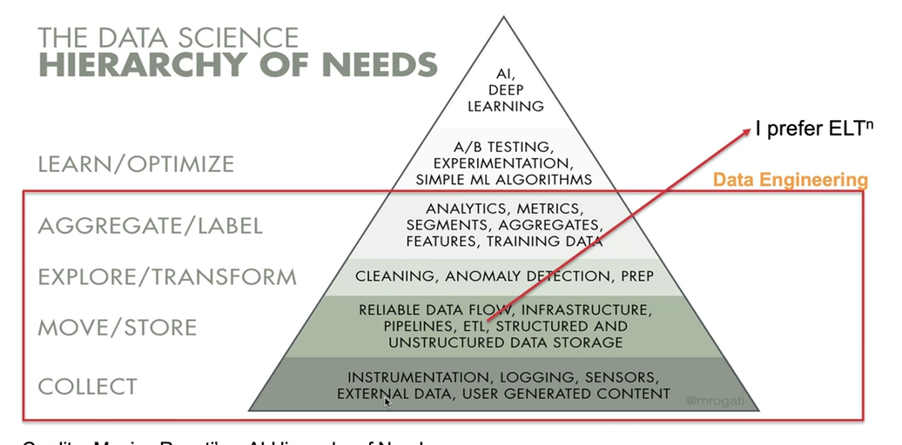
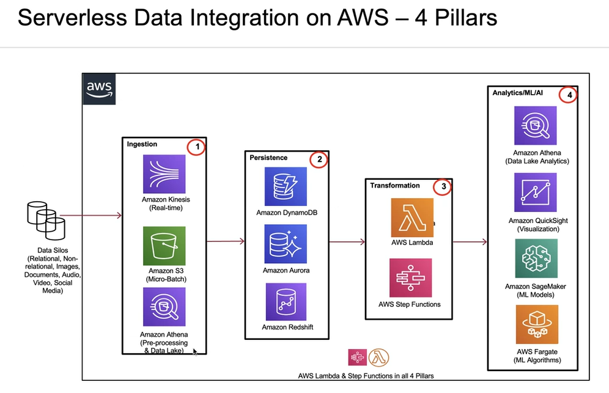
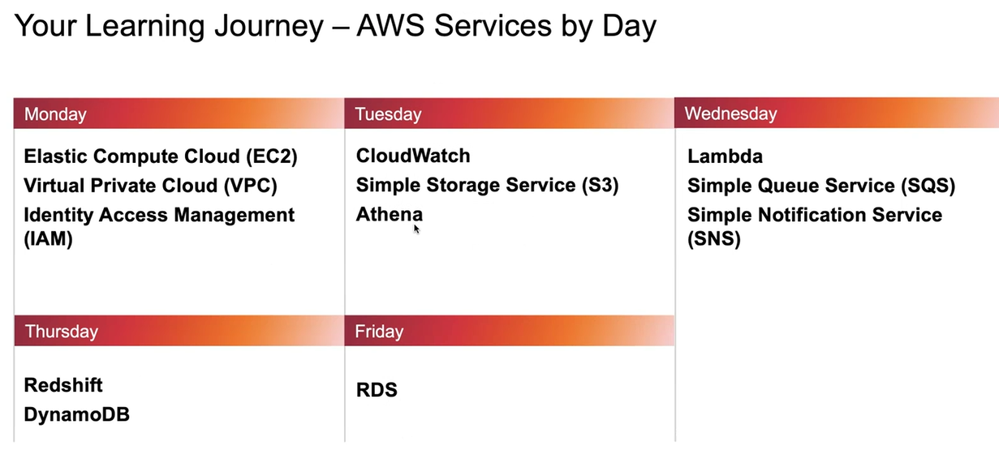

# AWS overview

>Gaja Krishna Vaidyanatha | Director – Consulting Expert | Cloud Solutions Architecture

## Assignments / Timeline

[x] Technical Essentials
[x] Data Analytics Fundamentals
[x] [Well-Architectured Framework](https://aws.amazon.com/blogs/apn/the-6-pillars-of-the-aws-well-architected-framework/)
[ ] Find 6th Pillar - Tonight
[ ] [Whitepaper Read (PDF)](https://docs.aws.amazon.com/wellarchitected/latest/serverless-applications-lens/wellarchitected-serverless-applications-lens.pdf#welcome) By tomorrow
[ ] Take AWS Cloud Practitioner Exam within 30 days from this Friday
[ ] Solutions Architect (180-270 days)

---

## Advice

- 3h
  - Honesty
  - Humility
  - Hunger
- Create your destiny
  - reap what you sow
- Be present
  - Eliminate notifications and distractions
  - Focus on learning
- Engage
  - Ask questions
  
## The Data Problem

### Data Silos - a Global Problem

- Redundant copies for different applications caused problems

### Data Lakes

- Sore data in near-exact native format
- Data Lake != Data Integration
- If data is not great to begin with, it is still poor quality in the lake

---

## Data Engineering

- Disciplined & structured compentency for moving, processing and delivering high-quality data
- Single source of data ***Data Integration Hub***
- Key characteristics
  - Automated
  - Consistent
  - Reliable
  - Resilient
  - Scalable
  - Cost-effective

[ ] Read Monica Rogati's AI Hierarchy of Needs

- ETL really **ELT^n**
  - Multiple transformations needed
- Classification and structure
  - Buckets based on security and risk
  - Determine storage based on type of data
- Ingestion
  - Real-time
  - Batch
  - Parameterized dynamic micro-pipelines
- Persistence
  - Fit-for Purpose
    - Objects
    - Relational
    - Document/Key-Value
    - Columnar
    - Graph
  - Information Lifecycle Management (ILM)
    - GDPR - regulatory mandates on how long you can hold some data
    - How long is it useful
    - Regulatory compliance
- Transformation
  - Data quality
  - Business Rules
  - Compliance rules
  - Re-processing for data and schema changes
  - Retroactive processing
  - Creation of curated objects (DIMENSION, FACT)
- Business Insights
  - KPIs/KRIs
  - Analytics
  - Machine Learning (ML)
  - Artificial Intelligence (AI)

## Security

- Public
- Internal
- Confidential
  - PII
- Restricted
  - UA - Criminal

## Structured vs Unstructured

- Outdated way of thinking
- Relational vs non-relational
- Even if Relational, doean't mean RDB is where it belongs
  - Could be S3
  - noSQL Key-Value pair
- Find right persistence layer for right data
- Data engineering is the foundation of data science
- Without high-quality data, it doesnt work

## Integration Hub

- *E pluribus unum*
- Single source of truth
- Integrates all data
- Continuously applies rules
  - Cleaning
  - Compliance
- Maintains object versions and track dependencies
  - Raise
  - Relocation
- Supports data lineage and cataloging
- Why?
  - Customer c

## Data Integration Hyb - Processing Pillars

1. **Ingestion**
   1. Rudimentary datatype checks
   2. Pre-processing
   3. Separation of BATCH vs REAL-TIME
2. **Persistence**
   1. Stored internally in RAWDB (like a Data Lake)
   2. Maintains versions - lineage, auditing and tracing for regulatory requirements
3. **Transformation**
   1. Rules aplies - Data quality, reg
   2. RAWDB -> CLEANB / ERRORDB
   3. Maintains Versions
4. Analytics/ML/AI
   1. Fed from CLEANDB
   2. Generates KPIs -> INSIGHTDB
   3. Maintains Versions

## Serverless Data Integration on AWS

1. Ingestion
   1. Kinesis (real-time)
   2. S3 (micro-batch)
   3. Athena (pre-processing / data lake)
2. Persistence
   1. DynamoDB (Lab Thursday)
   2. Aurora - relational service. Amazon version of mySQL/Postgress for cloud (Friday)
   3. Redshift - analytics, large data at scale | Snowflake is an alternative, also serverless
3. Transformation - where the magic happens
   1. Lambda
   2. Step functions - Coordinating layer for Lambdas
4. Analytics/ML/AI
   1. Athena - Data Lake Analytics - Datalake SQL with external layers
   2. QuickSight - Visualization, dashboards, graphs - not as rich as Lookr or Tableau
   3. SageMaker - ML Models
   4. Fargate - ML Algorithms

---

## Cloud Computing

> Providers, Characteristics, AWS Configurations

### Cloud Service Providers

- Microsoft Azure
- IBM
- AWS
- Oracle Cloud
- Google Cloud
- Alibaba Cloud

### Key Characteristics

1. Web-portal for renting compute resources
2. Pay-as-you-go or pay-per-usage
3. Virtual for you <--> Physical for CSPs
4. Quick [De-]Provisioning
5. Elastic Scale Up or Down(compute resources / storage), in or out (more servers / nodes)
6. Can be fault-resilient, if designed so

### AWS Cloud Configuration

- 21 geographic **`REGIONS`**
- Each **`REGION`** has two or more **`AVAILABILITY ZONES (AZ)`**
- **`AZ`** independent data center with its own resources
- `Highly Available` configration requires 2 or more AZs
- Cost = CPU + Storage + Data Egress

---
## Core services for Data Engineering

> 12 services that get your data engineering journey going

### Dozen services

1. Elastic Compute Cloud (EC2) - *virtual machine (server*)
2. Virtual Private Cloud (VPS) - *Logical Networking Isolation (Networking)*
3. Identity & Access Management (IAM) - *Security policies, roles, and privileges*
4. CloudWatch - *Activity Monitoring*
5. Simple Storage Service (S3) - *Serverless object server*
6. Athena - *Serverless SQL Engine for External Tables*
7. Lambda - *Serverless Functions (Programs)*
8. Simple Queue Service (SOS) - *serverless messaging for event-driven architectures*
9. Simple Notification Service (SNS) - *notifications email/sms*
10. Redshift - *cloud data warehouse*
11. DynamoDB - *NoSQL Database*
12. Relational Databae Service (RDS) - *Postgres, MySQL, Aurora Serverless*

- 12 out of 243 services
- Data Science - want to do SageMaker in the cloud - learn process to go out and get it

## EC2 - Intro

- [ ] Get own free-tier instance
- Service to deploy virtual machines / servers for a variety of computing workloads
  - instance families (c*n*, m*n*, r*n*)
  - `*n*` is the generation number
- EC2 instances require VPC (Virtual Private Cloud)
- Multiple pricing models
  - `SPOT` - discounted, but can be removed with limited notice, need rules
  - `RESERVED` - paid for up front, 1/3 years, most cost-effective that you can count on, paid whether you use or not
  - `ON-DEMAND` - most expensive
  -` SAVINGS PLANS`
- Hibernating / stopping instance may or may not impact the bill, depending on pricing model used
- Storage via `BLOCK DEVICES` - `INSTANCE STORE`(ephemeral), `EBS VOLUMES`(permanence)
- Instance Store
  - Data in not persisted across `STOP`, `TERMINATION` or `FAILURE(S)`
  - EC2 instances backed up by Instance Store can **only** be **rebooted** or **terminated**
- EBS VOlumes
  - Can be `STARTED`, `STOPPED`, `HIBERNATED`, or `TERMINATED`
  - Various types for a variety of workloads
  - Supports full encryption but **ONLY with AWS-Managed keys**
- EFS (Elastic File System)

---
