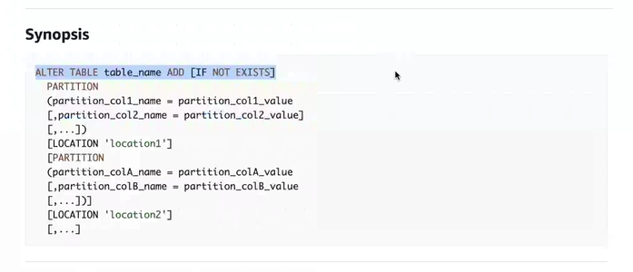

# AWS Office Hours

- Document in Sharepoint detailing AWS architect journey (3-6 months)
- AWS Certified Solutions Architect Study Guide 3rd edition book
- Set up APN account with cgi email address
- AWS pricing calculator useful for bonus
- Costs components
  - Compute
  - Storage
  - Egress
- Exam: I want you to estimate -- pricing calculator
- Cost calculator - real thing, what happened in the last month
- AWS Budgets - exam old provisioned ec2 instances, help identify underutilization. What % allocated have you actually used
- Deleted
  - EC2
    - Have an AMI - create from that
  - DynamoDB
  - SNS
  - SRS
- RDS lab instructions on channel
  - Use syntax from the Redshift lab to create table
  - bootcamp_rds_478003
- Tomorrow: API gateway discussion
- Download and install MySQLWorkbench
- Cloud9
- Install MySQL on EC2 instance
- Working version of final Lambda
- Save things locally
- Make sure you have a good Lambda
- Lambda console - export option
- YAML vs Full-deployment package - use full deployment
  - In zip there is the `.py` file with complete lambda
- Change EMP_ID on `.py` files
- How do you automate partition additions programatically?
  - Declare an Athena Client or resource
  - Run query that adds partition each time the Lambda runs
  - 
- `IF NOT EXIST` syntax
- Build excel spreadsheet
  - Findings
  - Recommendations - instance to use

# 06JUN

- Phrase consturctive criticism with "Even better if..." Rather than "_______ but ___"
- Make people feel comfortable and make sure others feel loved
- Magic starts happening then - team chemistry looking out for each other
- Build bond with each other over the academy to take with you
- Feel like part of the fabric
- Reach others on their level - diversity and inclusion
- Sensecorp acquired by CGI - had good culture
  - Participated in Ramadan fasting with folks
- Kubernetes containers with different parameters
  - Underlying essence is the same
- If you hear anyone making a borderline snide / disrespectful / etc. remark - interdict immediately
- 36 our fast every couple weeks. Water and tea. 11th day after the full moon. Start one evening after dinner - complete second day, then break fast the third morning.
- Lamb biryani - Hyderabad
- 