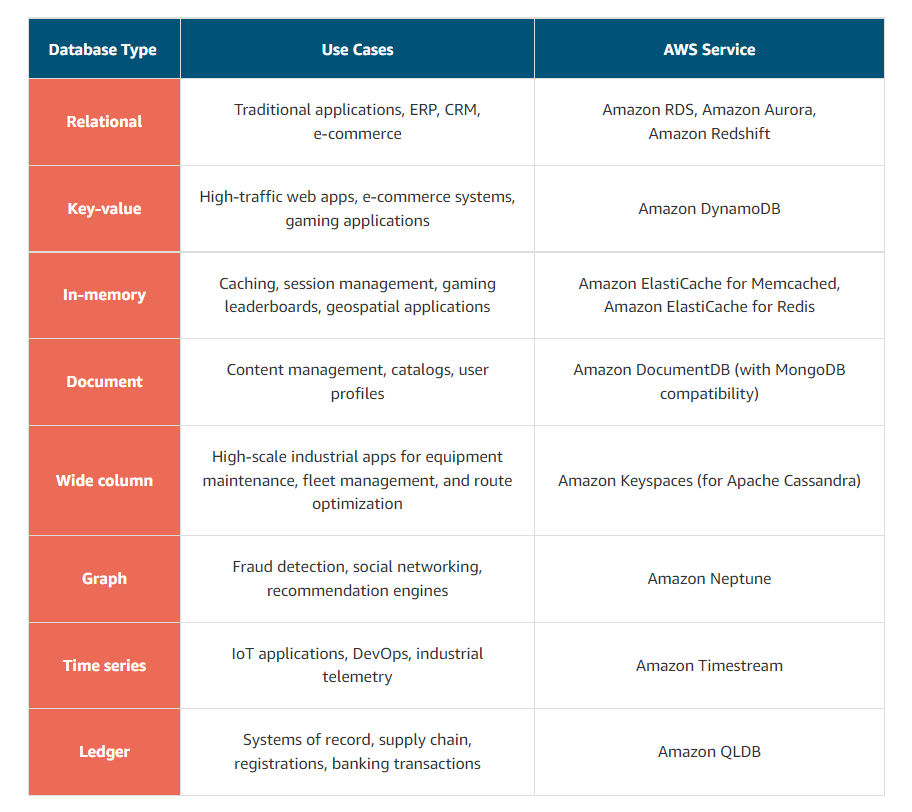

# AWS Technical Essentials 1.0.4

## Instructors

> Morgan Willis |Sr. Cloud Technologist | CS Degree | > 10 yrs
> Alana Laden | Cloud Technologist

## Outline

- Key concepts cloud computing
- Real Examples
- COmpute
  - Elastic Compute
  - Serverless - lambda
- Networking
  - Virtual private cloud
- Storage
  - S3 - simple storage service
  - Elastic block store
- Databases
  - Amazon Dynamo Db
- Monitoring and scaling
  - EC2
  - Elastic load balancing

## Overview

- Background
- Architecture
- Security
- Identity / access management
- CRUD create, read, update, delete

## What is AWS?

- On-premises cloud computing
- Before the coloud, companies hosted and maintained their own hardware to compute and store data as well as networking equipment in their own data centers -- costly and limited.
- Cloud computing emerged with the internet as demand for computation and storage increased
- Cloud computing is an on-demand delivery of IT resources over the internet
  - Pay-as-you-go pricing
  - Do not have to own, manage, and maintain hardware and data centers
  - Other companies own and maintain and provide virtual data center technology

## Advantages of cloud computing

1. Pay as you go
2. Massive economies of scale
3. Stop guessing capacity - access as much or as little as you need while scaling up and down
4. Increase speed and agility - resources one click away
5. Realize cost savings - focus on your business instead of managing data centers
6. Go global in minuted

**Resources**

- [External Site: AWS: What Is Cloud Computing?](https://aws.amazon.com/what-is-cloud-computing/)
- [External Site: AWS: Types of Cloud Computing](http://docs.aws.amazon.com/whitepapers/latest/aws-overview/types-of-cloud-computing.html)
- [External Site: AWS: Cloud Computing with AWS](https://aws.amazon.com/what-is-aws/)
- [External Site: AWS: Overview of Amazon Web Services](https://docs.aws.amazon.com/whitepapers/latest/aws-overview/aws-overview.pdf)

## AWS Global Infrastructure

- File storage - upload to AWS for backup the you can access them from anywhere. Redundant systems
- Availability Zone (AZ) - Redundant centers
- Region - is cluster of AZs
- Considerations
  - Compliance - may be required to handle data in a certain way
  - Latency - proximity of data to users
  - Pricing
  - Service Availability

**Resources**

- [External Site: AWS: Global Infrastructure](https://aws.amazon.com/about-aws/global-infrastructure/)
- [External Site: AWS: AWS Global Infrastructure Documentation](https://docs.aws.amazon.com/whitepapers/latest/aws-overview/global-infrastructure.html)
- [External Site: AWS: AWS Regions and Availability Zones](https://aws.amazon.com/about-aws/global-infrastructure/regions_az/)
- [External Site: AWS: AWS Service Endpoints](https://docs.aws.amazon.com/general/latest/gr/rande.html)
- [External Site: AWS: AWS Regional Services](https://aws.amazon.com/about-aws/global-infrastructure/regional-product-services/)

## Interacting with AWS

- API calls through a variety of platgorms
- AWS Management Console
  - Web-based
  - Login
  - Point and click
  - No scripting or syntax needed
- AWS Command Line Interfave (AWS CLI)
  - Do things programatically
  - Can schedule scripts
- WWS software development kits (SDKs)
  - SDKs are open source and maintained by AWS for the most popular programming languages, such as C++, Go, Java, JavaScript, .NET, Node.js, PHP, Python, and Ruby
  - Developers commonly use AWS SDKs to integrate their application source code with AWS services.

**Resources**

- [External Site: AWS: Working with the AWS Management Console](https://docs.aws.amazon.com/awsconsolehelpdocs/latest/gsg/getting-started.html)
- [External Site: AWS: AWS Command Line Interface](https://aws.amazon.com/cli/)
- [External Site: AWS: Tools to Build on AWS](https://aws.amazon.com/tools/)

## Security / Shared Responsibility

### AWS responsibility

- AWS is responsible for security of the cloud. 
- Protecting and securing AWS Regions, Availability Zones, and data centers, down to the physical security of the buildings
- Managing the hardware, software, and networking components that run AWS services
  - Physical servers
  - Host operating systems
  - Virtualization layers
  - AWS networking components

### Customer responsibility

- Customers are responsible for security in the cloud.
  - Responsible for properly configuring the service and your applications, in addition to ensuring that your data is secure.

[External Site: AWS: Shared Responsibility Model](https://aws.amazon.com/compliance/shared-responsibility-model/)

## Protecting AWS Root User

- Unrestricted access to everything
- MFA recommended for root user

### Authentication

- When you create your AWS account, you use the combination of an email address and a password to verify your identity.
- Authentication ensures that the user is who they say they are.
- User names and passwords are the most common types of authentication
- Token-based authentication
- Biometric data, like a fingerprint.
- Authentication simply answers the question, “Are you who you say you are?”

### Authorization

- Authorization is the process of giving users permission to access AWS resources and services.
- Authorization determines whether a user can perform certain actions
  - Read
  - Edit
  - Delete
  - Create resources.
- Authorization answers the question, “What actions can you perform?”

**Resources** 

- [External Site: AWS: Enabling a Hardware MFA Device (Console)](https://docs.aws.amazon.com/IAM/latest/UserGuide/id_credentials_mfa_enable_physical.html)
- [External Site: AWS: Enabling a U2F Security Key (Console)](https://docs.aws.amazon.com/IAM/latest/UserGuide/id_credentials_mfa_enable_u2f.html)
- [External Site: AWS: Enabling a Virtual Multi-Factor Authentication (MFA) Device (Console)](https://docs.aws.amazon.com/IAM/latest/UserGuide/id_credentials_mfa_enable_virtual.html)
- [External Site: AWS: Table of Supported MFA Devices](https://aws.amazon.com/iam/features/mfa/)

## Identity and access management (IAM)

- AWS service that helps you manage access to your AWS account and resources
- Provides a centralized view of who and what are allowed inside your AWS account (authentication)Who and what have permissions to use and work with your AWS resources (authorization)
- Provide granular access to those working in your account
- IAM is global and not specific to any one Region.
- IAM is integrated with many AWS services by default.
- You can establish password policies in IAM to specify complexity requirements and mandatory rotation periods for users.
- IAM supports MFA.
- IAM supports identity federation, which allows users who already have passwords elsewhere – for example, in your corporate network or with an internet identity provider – to get temporary access to your AWS account.
Any AWS customer can use IAM; the service is offered at no additional charge.
- Users, groups, policies

**Resources**

- [External Site: What Is IAM?](https://docs.aws.amazon.com/en_us/IAM/latest/UserGuide/introduction.html)
- [External Site: AWS IAM Identities](https://docs.aws.amazon.com/en_us/IAM/latest/UserGuide/id.html)
- [External Site: Access Management with AWS IAM](https://docs.aws.amazon.com/en_us/IAM/latest/UserGuide/access.html)

## Role-based access

- Loack down AWS root
- Follow principle of least privilege
- Use IAM appropriately
- Use IAM roles when possible - maintaining role is more efficient than maintaining users
- Consider using an identity provider (IdP) - for users with multiple roles in multiple dbs
- Consider AWS single sign on - many employees and multiple AWS accounts

**Resources**

- [External Site: AWS: Security Best Practices in IAM](https://docs.aws.amazon.com/IAM/latest/UserGuide/best-practices.html)
- [External Site: AWS: How to Create and Manage Users within AWS Single Sign-On](https://aws.amazon.com/blogs/security/how-to-create-and-manage-users-within-aws-sso/)

## AWS IAM Demo

- Configure 3 users with unique permissions

## Employee Directory Application Hosting

- Host on Amazon EC2
- Management console
- EC2 - compute service for virtual machines
- Create an instance - single virtual machine
- Configure instance details

## Module II: AWS Compute

### Compute as A service

#### Servers

- First building block you need to host an application is a server
- Handle Hypertext Transfer Protocol (HTTP) requests and send responses to clients following the client-server model
- Servers power your application by providing CPU, memory, and networking capacity to process users’ requests and transform them into responses. 

** Resources**

- [External Site: AWS: Compute Services Whitepaper](https://docs.aws.amazon.com/whitepapers/latest/aws-overview/compute-services.html)
- [External Site: AWS: Compute on AWS](https://aws.amazon.com/products/compute/)
- [External Site: AWS: AWS Compute Blog](https://aws.amazon.com/blogs/compute/)

### Elastic Compute Cloud (EC2)

- Amazon EC2 is a web service that provides secure, resizable compute capacity in the cloudProvision virtual servers called EC2 instances
- To create an EC2 instance, you must define the following:
  - Hardware specifications, like CPU, memory, network, and storage
  - Logical configurations, like networking location, firewall rules, authentication, and the operating system of your choice

#### Amazon Machine Image

- You can select an AMI from the following categories:
  - Quick Start AMIs, which are created by AWS to help you get started quickly
    - AWS Marketplace AMIs, which provide popular open source and commercial software from third-party vendors
    - My AMIs, which are created from your EC2 instances
    - Community AMIs, which are provided by the AWS user community
    - Build your own custom image with EC2 Image Builder

**Resources**

- [External Site: AWS: Amazon EC2](https://aws.amazon.com/ec2/)
- [External Site: AWS: Amazon Machine Images (AMI)](https://docs.aws.amazon.com/AWSEC2/latest/UserGuide/AMIs.html)
- [External Site: AWS: Creating an Amazon EBS-backed Linux AMI](https://docs.aws.amazon.com/AWSEC2/latest/UserGuide/creating-an-ami-ebs.html)
- [External Site: AWS: What Is EC2 Image Builder?](https://docs.aws.amazon.com/imagebuilder/latest/userguide/what-is-image-builder.html)

### EC2 Instance Lifecycle

- New instances on demand
- Get rid of ones you don't need
- Able to scale in or out

#### Instance Types

- Amazon EC2 instances are a combination of virtual processors (vCPUs), memory, network, and, in some cases, instance storage and graphics processing units (GPUs).
- When you create an EC2 instance, you need to choose how much you need of each of these components.

**Resources**

- [External Site: AWS: Amazon EC2](https://aws.amazon.com/ec2/)
- [External Site: AWS: Default VPC and Default Subnets](https://docs.aws.amazon.com/vpc/latest/userguide/default-vpc.html)
- [External Site: AWS: AWS Reliability Pillar (PDF)](https://d1.awsstatic.com/whitepapers/architecture/AWS-Reliability-Pillar.pdf)
- [External Site: AWS: Instance Lifecycle](https://docs.aws.amazon.com/AWSEC2/latest/UserGuide/ec2-instance-lifecycle.html)
- [External Site: AWS: Amazon EC2 Pricing](https://aws.amazon.com/ec2/pricing/)
- [External Site: AWS: Amazon EC2 On-Demand Pricing](https://aws.amazon.com/ec2/pricing/on-demand/)
- [External Site: AWS: Amazon EC2 Spot Instances Pricing](https://aws.amazon.com/ec2/spot/pricing/)
- [External Site: AWS: Amazon EC2 Reserved Instances Pricing](https://aws.amazon.com/ec2/pricing/reserved-instances/pricing/)

### Container Services

- AWS offers a broad spectrum of compute offerings that give you the flexibility to choose the right tool for the job
  - Virtual machines (VMs)
  - Containers (ie, Docker, Kubernetes)
  - Serverless

- Container orchestration tools
- Shorter boot time than virtual machines

**Resources**

- [External Site: AWS: Containers on AWS](https://aws.amazon.com/containers/services/)
- [External Site: Docker: What Is a Container?](https://www.docker.com/resources/what-container)
- [External Site: AWS: Amazon Elastic Container Service](https://aws.amazon.com/ecs/)
- [External Site: Github: Amazon ECS Agent](https://github.com/aws/amazon-ecs-agent)
- [External Site: AWS: Amazon ECS ContainerInstances](https://docs.aws.amazon.com/AmazonECS/latest/developerguide/ECS_instances.html)
- [Coursera Course: Building Containerized Applications on AWS](https://www.coursera.org/learn/containerized-apps-on-aws)

### Serverless

- If you run your code on Amazon EC2, AWS is responsible for the physical hardware, and you are responsible for the logical controls, such as guest operating system, security and patching, networking, security, and scaling.
- If you run your code in containers on Amazon ECS and Amazon EKS, AWS is responsible for more of the container management, such as deploying containers across EC2 instances and managing the container cluster. However, when running ECS and EKS on EC2, you are still responsible for maintaining the underlying EC2 instances.
- If you want to deploy your workloads and applications without having to manage any EC2 instances, you can do that on AWS with serverless compute.
- EC2 or containers - must set up and maintain fleet of instances
- Software and security patches, scaling, architecting solutions
- Cannot see or access underlying structure or instances
- Managemet of structures taken care of for you
- *Abstracted*
- Convenient to use - focus on value of service while not having to worry about operational details
- Shifts some responsibility from you to AWS for many tasks

### AWS Lambda

- One of the serverless options
- Create Lambda function 
- Run in response to triggers
- Trigger, code and configuration
- Not billed for code that isn't running

**Resources**

- [External Site: AWS: Serverless](https://aws.amazon.com/serverless/#:~:text=Serverless%20is%20the%20native%20architecture,services%20without%20thinking%20about%20servers.)
- [Coursera Course: Building Modern Python Applications on AWS](https://www.coursera.org/learn/building-modern-python-applications-on-aws)
- [External Site: AWS: AWS Serverless Resources](https://aws.amazon.com/serverless/resources/?serverless.sort-by=item.additionalFields.createdDate&serverless.sort-order=desc)
- [External Site: AWS: Building Applications with Serverless Architectures](https://aws.amazon.com/lambda/serverless-architectures-learn-more/)
- [External Site: AWS: Best Practices for Organizing Larger Serverless Applications](https://docs.aws.amazon.com/lambda/latest/dg/lambda-functions.html)
- [External Site: AWS: Managing AWS Lambda Functions](https://docs.aws.amazon.com/lambda/latest/dg/lambda-functions.html)
- [External Site: AWS: 10 Things Serverless Architects Should Know](https://aws.amazon.com/blogs/architecture/ten-things-serverless-architects-should-know/)
- [External Site: AWS: AWS Alien Attack! A Serverless Adventure](https://alienattack.workshop.aws/)

## Module 3: Networking

- Networking is how you connect computers around the world and allow them to communicate with one another.
- One way to think about networking is to think about sending a letter. When you send a letter, you provide the following three elements:
  - The payload, or letter, inside the envelope.
  - The address of the sender in the From section.
  - The address of the recipient in the To section.
- **IP addresses** Just like each home has a mailing address, each computer has an IP address. However, instead of using the combination of street, city, state, zip code, and country, the IP address uses a combination of bits, 0s and 1s.
- **IPv4 notation** Typically, you don’t see an IP address in its binary format. Instead, it’s converted into decimal format and noted as an Ipv4 address.
- **CIDR notation**  Classless Inter-Domain Routing (CIDR) notation. 
  - CIDR notation is a compressed way of specifying a range of IP addresses

**Resources**

- [External Site: Stanford: Introduction to Computer Networking](https://web.stanford.edu/class/cs101/network-1-introduction.html)
- [External Site: Wikipedia: Classless Inter-Domain Routing](https://en.wikipedia.org/wiki/Classless_Inter-Domain_Routing)
- [External Site: CIDR.xyz](https://cidr.xyz/)

### Virtual Private Cloud

- A virtual private cloud (VPC) is an isolated network that you create in the AWS Cloud, similar to a traditional network in a data center.
- When you create a VPC, you must choose three main factors:
  - Name of the VPC.
  - Region where the VPC will live.
    -  Each VPC spans multiple Availability Zones within the selected Region.
  - IP range for the VPC in CIDR notation.
    - This determines the size of your network.
    - Each VPC can have up to four /16 IP ranges.

#### Create a subnet

- After you create your VPC, you must create subnets inside the network.
- Smaller networks inside your base network
- When you create a subnet, you must specify the following:
  - VPC you want your subnet to live in. In this case: VPC (10.0.0.0/16)
  - Availability Zone you want your subnet to live in. In this case: AZ1
  - CIDR block for your subnet, which must be a subset of the VPC CIDR block. In this case: 10.0.0.0/24

**Resources**

- [External Site: AWS: VPC with Public and Private Subnets (NAT)](https://docs.aws.amazon.com/vpc/latest/userguide/VPC_Scenario2.html)
- [External Site: AWS: Custom Route Tables](https://docs.aws.amazon.com/vpc/latest/userguide/VPC_Route_Tables.html#CustomRouteTables)
- [External Site: Customer Gateway](https://docs.aws.amazon.com/vpn/latest/s2svpn/how_it_works.html#CustomerGateway)
- [External Site: AWS: What Is Amazon VPC?](https://docs.aws.amazon.com/vpc/latest/userguide/what-is-amazon-vpc.html)
- [External Site: AWS: VPCs and Subnets](https://docs.aws.amazon.com/vpc/latest/userguide/VPC_Subnets.html)

### VPC Routing

#### Main route table

- When you create a VPC, AWS creates a route table called the main route table.
- A route table contains a set of rules, called routes, that are used to determine where network traffic is directed.
- AWS assumes that when you create a new VPC with subnets, you want traffic to flow between them.
- Therefore, the default configuration of the main route table is to allow traffic between all subnets in the local network.
- The destination and target are two main parts of this route table.
  - The **destination** is a range of IP addresses where you want your traffic to go. In the example of sending a letter, you need a destination to route the letter to the appropriate place. The same is true for routing traffic. In this case, the destination is the VPC network's IP range.
  - The **target** is the connection through which to send the traffic. In this case, the traffic is routed through the local VPC network.

### VPC Security

- Secure subnets with network access control lists
- Network Access Control Lists (Network ACLs)
  - Firewall at subnet level
- Secure EC2 instances with security groups
  - Firewalls at the EC2 instance level
  - The default configuration of a security group blocks all inbound traffic and allows all outbound traffic.

**Resources**

- [External Site: AWS: Route Tables](https://docs.aws.amazon.com/vpc/latest/userguide/VPC_Route_Tables.html)
- [External Site: AWS: Example Routing Options](https://docs.aws.amazon.com/vpc/latest/userguide/route-table-options.html)
- [External Site: AWS: Working with Routing Tables](https://docs.aws.amazon.com/vpc/latest/userguide/WorkWithRouteTables.html)
- [External Site: AWS: Network ACLs](https://docs.aws.amazon.com/vpc/latest/userguide/vpc-network-acls.html)
- [External Site: AWS: Security Groups for Your VPC](https://docs.aws.amazon.com/vpc/latest/userguide/VPC_SecurityGroups.html)
- [External Site: AWS: I Host a Website on an EC2 Instance. How Do I Allow My Users to Connect on HTTP (80) or HTTPS (443)?](https://aws.amazon.com/premiumsupport/knowledge-center/connect-http-https-ec2/)

## Module 4: Storage

AWS storage services are grouped into three categories – block storage, file storage, and object storage.
- **File storage** File storage is ideal when you require centralized access to files that need to be easily shared and managed by multiple host computers.
- Common use cases for file storage include:
  - Large content repositories
  - Development environments
  - User home directories
- **Block storage** While file storage treats files as a singular unit, block storage splits files into fixed-size chunks of data called blocks that have their own addresses. Since each block is addressable, blocks can be retrieved efficiently.
- **Object storage** Objects, much like files, are treated as a single unit of data when stored. However, unlike file storage, these objects are stored in a flat structure instead of a hierarchy. Each object is a file with a unique identifier.

**Resources**

- [External Site: AWS: What Is Cloud Storage](https://aws.amazon.com/what-is-cloud-storage/)
- [External Site: AWS: Types of Cloud Storage](https://aws.amazon.com/what-is-cloud-object-storage/#types)

### EC2 Instance and Block Storage

#### Amazon EC2 instance store

- Amazon EC2 instance store provides temporary block-level storage for an instance.
- This storage is located on disks that are physically attached to the host computer.
- This ties the lifecycle of the data to the lifecycle of the EC2 instance.
- If you delete the instance, the instance store is deleted, as well.
- Due to this, instance store is considered ephemeral storage. 
- Read more about it in the [AWS documentation.](https://docs.aws.amazon.com/AWSEC2/latest/UserGuide/InstanceStorage.html)

#### Amazon Elastic Block Storage (Amazon EBS)

- Block-level storage device that you can attach to an Amazon EC2 instance.
- These storage devices are called Amazon EBS volumes.
- EBS volumes are essentially drives of a user-configured size attached to an EC2 instance, similar to how you might attach an external drive to your laptop.
- EBS volumes act similarly to external drives in more than one way.
  - Most Amazon EBS volumes can only be connected with one computer at a time. Most EBS volumes have a one-to-one relationship with EC2 instances, so they cannot be shared by or attached to multiple instances at one time. (Recently, AWS announced the Amazon EBS multi-attach feature that enables volumes to be attached to multiple EC2 instances at one time. This feature is not available for all instance types, and all instances must be in the same Availability Zone. Read more about this scenario in the EBS documentation.)
  - You can detach an EBS volume from one EC2 instance and attach it to another EC2 instance in the same Availability Zone, to access the data on it.
  - The external drive is separate from the computer. That means, if an accident occurs and the computer goes down, you still have your data on your external drive. The same is true for EBS volumes.
  - You’re limited to the size of the external drive, since it has a fixed limit to how scalable it can be. For example, you might have a 2-TB external drive, which means you can only have 2 TB of content on it. This relates to EBS as well, since a volume also has a max limitation of how much content you can store on it.

#### Amazon EBS use cases

- **Operating systems:** Boot/root volumes to store an operating system. The root device for an instance launched from an Amazon Machine Image (AMI) is typically an Amazon EBS volume. These are commonly referred to as EBS-backed AMIs.
- **Databases:** A storage layer for databases running on Amazon EC2 that rely on transactional reads and writes.
- **Enterprise applications:** Amazon EBS provides reliable block storage to run business-critical applications.
Throughput-intensive applications: Applications that perform long, continuous reads and writes.

#### Amazon EBS benefits

- **High availability:** When you create an EBS volume, it is automatically replicated in its Availability Zone to prevent data loss from single points of failure.
- **Data persistence**: The storage persists even when your instance doesn’t.
- **Data encryption**: All EBS volumes support encryption.
- **Flexibility:** EBS volumes support on-the-fly changes. You can modify volume type, volume size, and input/output operations per second (IOPS) capacity without stopping your instance.
- **Backups**: Amazon EBS provides the ability to create backups of any EBS volume

#### Amazon EBS snapshots - Backups

- Errors happen. One error is not backing up data and then inevitably losing it. To prevent this from happening to you, always back up your data – even in AWS.
- Since your EBS volumes consist of the data from your Amazon EC2 instance, you should make backups of these volumes, called snapshots.

**Resources**

- [External Site: AWS: Amazon Elastic Block Store (Amazon EBS)](https://docs.aws.amazon.com/AWSEC2/latest/UserGuide/AmazonEBS.html)
- [External Site: AWS: Amazon EBS FAQs](https://aws.amazon.com/ebs/faqs/)

### Object Storage with Simple Storage Service (S3)

- Unlike Amazon Elastic Block Store (Amazon EBS), Amazon Simple Storage Service (Amazon S3) is a standalone storage solution that isn’t tied to compute.
- It enables you to retrieve your data from anywhere on the web
- Amazon S3 is an object storage service.
- Object storage stores data in a flat structure, using unique identifiers to look up objects when requested.
- An object is  a file combined with metadata.
- You can store as many of these objects as you’d like.
- In Amazon S3, you store your objects in containers called buckets.
- You can’t upload any object, not even a single photo, to Amazon S3 without creating a bucket first.
- When you create a bucket, you specify, at the very minimum, two details – the AWS Region you want the bucket to reside in and the bucket name.
- Uses:
  - **Backup and storage:** Amazon S3 is a natural place to back up files because it is highly redundant. As mentioned in the last unit, AWS stores your EBS snapshots in S3 to take advantage of its high availability.
  - **Media hosting**: Because you can store unlimited objects, and each individual object can be up to 5 TBs, Amazon S3 is an ideal location to host video, photo, and music uploads.
  - **Software delivery:** You can use Amazon S3 to host your software applications that customers can download.
  - **Data lakes**: Amazon S3 is an optimal foundation for a data lake because of its virtually unlimited scalability. You can increase storage from gigabytes to petabytes of content, paying only for what you use.
  - **Static websites**: You can configure your S3 bucket to host a static website of HTML, CSS, and client-side scripts.
  - **Static content**: Because of the limitless scaling, the support for large files, and the fact that you access any object over the web at any time, Amazon S3 is the perfect place to store static content.

**Resources**

- [External link: Amazon S3](https://aws.amazon.com/s3/)
- [External link: Amazon S3 Storage Classes](https://aws.amazon.com/s3/storage-classes/)
- [External link: Using Versioning in S3 Buckets](https://docs.aws.amazon.com/AmazonS3/latest/userguide/Versioning.html)

### Choose the right storage service

#### Amazon EC2 instance store

- Instance store is ephemeral block storage.
- This is preconfigured storage that exists on the same physical server that hosts the EC2 instance and cannot be detached from Amazon EC2.
- You can think of it as a built-in drive for your EC2 instance.
- Instance store is generally well-suited for temporary storage of information that is constantly changing, such as buffers, caches, and scratch data.
- It is not meant for data that is persistent or long-lasting.
- If you need persistent long-term block storage that can be detached from Amazon EC2 and provide you more management flexibility, such as increasing volume size or creating snapshots, then you should use Amazon EBS.

#### Amazon EBS

- Amazon EBS is meant for data that changes frequently and needs to persist through instance stops, terminations, or hardware failures.
- Amazon EBS has two types of volumes – SSD-backed volumes and HDD-backed volumes.
- SSD-backed volumes have the following characteristics:
  - Performance depends on IOPS (input/output operations per second).
  - Ideal for transactional workloads, such as databases and boot volumes.
- HDD-backed volumes have the following characteristics:
  - Performance depends on MB/s.
  - Ideal for throughput-intensive workloads, such as big data, data warehouses, log processing, and sequential data I/O.
- Here are a few important features of Amazon EBS that you need to know when comparing it to other services.
  - It is block storage.
  - You pay for what you provision (you have to provision storage in advance).
  - EBS volumes are replicated across multiple servers in a single Availability Zone.
  - Most EBS volumes can only be attached to a single EC2 instance at a time.

#### Amazon S3

- If your data doesn’t change that often, Amazon S3 might be a cost-effective and scalable storage solution for you.
- Amazon S3 is ideal for storing static web content and media, backups and archiving, and data for analytics.
- It can also host entire static websites with custom domain names.
- Here are a few important features of Amazon S3 to know about when comparing it to other services:
  - It is object storage.
  - You pay for what you use (you don’t have to provision storage in advance).
  - Amazon S3 replicates your objects across multiple Availability Zones in a Region.
  - Amazon S3 is not storage attached to compute.

#### Amazon Elastic File System (Amazon EFS) and Amazon FSx

- For file storage that can mount on to multiple EC2 instances, you can use Amazon Elastic File System (Amazon EFS) or Amazon FSx.
- Here are a few important features of Amazon EFS and Amazon FSx to know about when comparing them to other services:
  - It is file storage.
  - You pay for what you use (you don’t have to provision storage in advance).
  - Amazon EFS and Amazon FSx can be mounted onto multiple EC2 instances.

**Resources**

- [External Site: AWS: Storage](https://docs.aws.amazon.com/AWSEC2/latest/UserGuide/Storage.html)
- [External Site: AWS: Cloud Storage on AWS](https://aws.amazon.com/products/storage/)
- [Amazon EFS: How It Works](https://docs.aws.amazon.com/efs/latest/ug/how-it-works.html)
- [Amazon FSx for Windows File Server](https://aws.amazon.com/fsx/windows/)
- [Amazon FSx for Lustre:](https://aws.amazon.com/fsx/lustre/)

## Module 5: Databases

### Relational databases

- A relational database organizes data into tables.
- Data in one table can be linked to data in other tables to create relationships – hence, the relational part of the name.
- A table stores data in rows and columns.
- A row, often called a record, contains all information about a specific entry.
- Columns describe attributes of an entry. Here’s an example of three tables in a relational database.

### Relational database management system

- A relational database management system (RDBMS) lets you create, update, and administer a relational database.
- Here are some common examples of relational database management systems:
  - MySQL
  - PostgresQL
  - Oracle
  - SQL server
  - Amazon Aurora

### Relational database benefits

- **Joins**: You can join tables, enabling you to better understand relationships between your data.
Reduced redundancy: You can store data in one table and reference it from other tables instead of saving the same data in different places.
- **Familiarity**: Relational databases have been a popular choice since the 1970s. Due to this popularity, technical professionals often have familiarity and experience with this type of database.
- **Accuracy**: Relational databases ensure that your data is persisted with high integrity and adheres to the atomicity, consistency, isolation, durability (ACID) principle.

### Relational database use cases

- Much of the world runs on relational databases. In fact, they’re at the core of many mission-critical applications, some of which you might use in your day-to-day life. 
- Here are some common use cases for relational databases.
  - Applications that have a solid schema that doesn’t change often, such as lift-and-shift applications that lift an app from on-premises and shifts it to the cloud, with little or no modifications.
  - Applications that need persistent storage that follow the ACID principle, such as:
    - Enterprise resource planning (ERP) applications
    - Customer relationship management (CRM) applications
    - Commerce and financial applications

**Resources** 

- [External Site: AWS: What Is a Relational Database?](https://aws.amazon.com/relational-database/)
- [External Site: AWS: Databases on AWS](https://aws.amazon.com/products/databases/)

### Amazon Relational Database Service (RDS)

- Lets customers create and manage relational databases in the cloud without the operational burden of traditional database management.
- Amazon RDS offloads some of the unrelated work of creating and managing a database.
- You can focus on the tasks that differentiate your application, instead of focusing on infrastructure-related tasks
- Amazon RDS supports most of the popular relational database management systems, ranging from commercial options, open source options, and even an AWS-specific option. The supported Amazon RDS engines are:
- **Commercial**: Oracle, SQL Server
- **Open Source**: MySQL, PostgreSQL, MariaDB
- **Cloud Native**: Amazon Aurora

**Resources**

- [External Site: AWS: Working with Backups](https://docs.aws.amazon.com/AmazonRDS/latest/UserGuide/USER_WorkingWithAutomatedBackups.html)
- [External Site: AWS: Amazon RDS Backup and Restore](https://aws.amazon.com/rds/details/backup/)
- [External Site: AWS: Creating and Using an IAM Policy for IAM Database Access](https://docs.aws.amazon.com/AmazonRDS/latest/UserGuide/UsingWithRDS.IAMDBAuth.IAMPolicy.html)
- [External Site: AWS: Amazon Virtual Private Cloud VPCs and Amazon RDS](https://docs.aws.amazon.com/AmazonRDS/latest/UserGuide/USER_VPC.html)

### Amazon DynamoDB

- Non-relational
- Flexible schemas
- Amazon DynamoDB is a fully managed NoSQL database service that provides fast and predictable performance with seamless scalability.
- Lets you offload the administrative burdens of operating and scaling a distributed database so that you don't have to worry about hardware provisioning, setup and configuration, replication, software patching, or cluster scaling.
- Stand-alone tables
  - Items
    - Attributes
- With DynamoDB, you can create database tables that can store and retrieve any amount of data and serve any level of request traffic.
- You can scale up or scale down your tables' throughput capacity without downtime or performance degradation.
- You can use the AWS Management Console to monitor resource usage and performance metrics.
- The following are the basic DynamoDB components:
  - **Tables** – Similar to other database systems, DynamoDB stores data in tables. 
    - A table is a collection of data. 
  - **Items** – Each table contains zero or more items. 
    - An item is a group of attributes that is uniquely identifiable among all the other items. 
    - In a People table, each item represents a person. In a Cars table, each item represents one vehicle. Items in DynamoDB are similar in many ways to rows, records, or tuples in other database systems. In DynamoDB, there is no limit to the number of items you can store in a table.
  - **Attributes** – Each item is composed of one or more attributes.
    - An attribute is a fundamental data element, something that does not need to be broken down any further.
    - For example, an item in a People table might contain attributes called PersonID, LastName, FirstName, and so on.

**Resources**

- [External Resource: Introduction to Amazon DynamoDB](https://docs.aws.amazon.com/amazondynamodb/latest/developerguide/Introduction.html)

### Choose the right Database Service

**Resources**

- [External Site: AWS: Databases on AWS](https://aws.amazon.com/products/databases/)
- [External Site: AWS: AWS Database Blog](https://aws.amazon.com/blogs/database/?nc=sn&loc=4)
- [External Site: AWS: Database Freedom](https://aws.amazon.com/products/databases/freedom/?nc=sn&loc=5)

## Module 6: Monotoring, Optimization, and serverless

### Monitoring

- When operating a website like the Employee Directory Application on AWS, you might have questions like:
  - How many people are visiting my site day to day?
  - How can I track the number of visitors over time?
  - How will I know if the website is having performance or availability issues?
  - What happens if my Amazon Elastic Compute Cloud (EC2) instance runs out of capacity?
  - Will I be alerted if my website goes down?
- Monitoring benefits:
  - **Respond to operational issues proactively before your end users are aware of them**.
  - **Improve the performance and reliability of your resources.**
  - **Recognize security threats and events**. 
    - When you monitor resources, events, and systems over time, you create what is called a baseline.
    - A baseline defines what activity is normal.
    - Using a baseline, you can spot anomalies like unusual traffic spikes or unusual IP addresses accessing your resources. 
    - When an anomaly occurs, an alert can be sent out or an action can be taken to investigate the event.
  - **Make data-driven decisions for your business**.
- You can use CloudWatch to:
  - Detect anomalous behavior in your environments
  - Set alarms to alert you when something is not right
  - Visualize logs and metrics with the AWS Management Console
  - Take automated actions like scaling
  - Troubleshoot issues
  - Discover insights to keep your applications healthy

**Resource**

- [External Site: AWS: Amazon CloudWatch](https://aws.amazon.com/cloudwatch/)

### Amazon CloudWatch

- managed service that you can use for monitoring, without managing the underlying infrastructure
- Many AWS services send metrics automatically for free to CloudWatch at a rate of one data point per metric per 5-minute interval.
- This gives you visibility into your systems without any extra cost.
- This is known as basic monitoring.
- For many applications, basic monitoring is adequate.
- Custom metrics, dashboards, logs, alarms

**Resources**

- [External Site: AWS: Getting Started with Amazon CloudWatch](https://docs.aws.amazon.com/AmazonCloudWatch/latest/monitoring/GettingStarted.html)
- [External Site: AWS: What Is Amazon CloudWatch Logs?](https://docs.aws.amazon.com/AmazonCloudWatch/latest/logs/WhatIsCloudWatchLogs.html)
- [External Site: AWS Services That Publish CloudWatch Metrics](https://docs.aws.amazon.com/AmazonCloudWatch/latest/monitoring/aws-services-cloudwatch-metrics.html)
- [External Site: AWS: View Available Metrics](https://docs.aws.amazon.com/AmazonCloudWatch/latest/monitoring/viewing_metrics_with_cloudwatch.html)
- [External Site: AWS: Amazon CloudWatch Pricing](https://aws.amazon.com/cloudwatch/pricing/)
- [External Site: AWS: Amazon Simple Notification Service](https://aws.amazon.com/sns/)
- [External Site: AWS: EC2 Auto Scaling Actions](https://aws.amazon.com/ec2/autoscaling/)

### Solution Optimization

#### Availability

- The availability of a system is typically expressed as a percentage of uptime in a given year or as a number of nines. 

**Resources**

- [External Site: High Availability and Scalability on AWS](https://docs.aws.amazon.com/whitepapers/latest/real-time-communication-on-aws/high-availability-and-scalability-on-aws.html)
- [External Site: AWS: AWS Reliability Pillar: AWS Well-Architected Framework](https://d1.awsstatic.com/whitepapers/architecture/AWS-Reliability-Pillar.pdf)

### Traffic routing with lastic Load Balancing (ELB)

- Load balancing refers to the process of distributing tasks across a set of resources.
- AWS provides a service for you called Elastic Load Balancing.
- The ELB service provides a major advantage over using your own solution to do load balancing – mainly, you don’t need to manage or operate it. It can distribute incoming application traffic across EC2 instances, containers, IP addresses, and AWS Lambda functions.
- Other key features include the following:
  - Because ELB can load balance to IP addresses, it can work in a hybrid mode, which mean it also load balances to on-premises servers.
  - ELB is highly available. The only option you must ensure is that the load balancer is deployed across multiple Availability Zones.
  - In terms of scalability, ELB automatically scales to meet the demand of the incoming traffic. It handles the incoming traffic and sends it to your backend application.
- Application Load Balancer:
  - **ALB routes traffic based on request data**. 
  - **ALB sends responses directly to the client**.
  - **ALB uses TLS offloading**.
  - **ALB authenticates users.**
  - **ALB secures traffic.**
  - **ALB uses the round-robin routing algorithm**
  - **ALB uses the least outstanding request routing algorithm**
  - **ALB uses sticky sessions**
- Network load balancer
  

**Resources**

- [External Site: AWS: Elastic Load Balancer Product Comparison](https://aws.amazon.com/elasticloadbalancing/features/#Product_comparisons)
- [External Site: AWS: AWS Certificate Manager](https://aws.amazon.com/certificate-manager/)
- [External Site: AWS: Authenticate Users Using an Application Load Balancer](https://docs.aws.amazon.com/elasticloadbalancing/latest/application/listener-authenticate-users.html)
- [External Site: AWS: How AWS WAF Works](https://docs.aws.amazon.com/waf/latest/developerguide/how-aws-waf-works.html)
- [External Site: AWS: Introducing AWS Gateway Load Balancer ](https://aws.amazon.com/blogs/aws/introducing-aws-gateway-load-balancer-easy-deployment-scalability-and-high-availability-for-partner-appliances/)

### EC2 Auto-Scaling

#### Capacity issues

- Availability and reachability is improved by adding one more server.
- However, the entire system can again become unavailable if there is a capacity issue.
- This section looks at load issue for both types of systems discussed – active-passive and active-active.
- Vertical and Horizontal scaling
- Autoscaling

**Resources**

- [External Site: AWS: Amazon EC2 Auto Scaling](https://aws.amazon.com/ec2/autoscaling/)
- [External Site: AWS: Amazon EC2 Auto Scaling FAQs](https://aws.amazon.com/ec2/autoscaling/faqs/)
- [External Site: AWS: Setting Capacity Limits for Your Auto Scaling Group](https://docs.aws.amazon.com/autoscaling/ec2/userguide/asg-capacity-limits.html)
- [External Site: AWS: Step and Simple Scaling Policies for Amazon EC2 Auto Scaling](https://docs.aws.amazon.com/autoscaling/ec2/userguide/as-scaling-simple-step.html)
- [External Site: AWS: Target Tracking Scaling Policies for Amazon EC2 Auto Scaling](https://docs.aws.amazon.com/autoscaling/ec2/userguide/as-scaling-target-tracking.html)
- [External Site: AWS: Creating an Auto Scaling Group Using a Launch Template](https://docs.aws.amazon.com/autoscaling/ec2/userguide/create-asg-launch-template.html)

