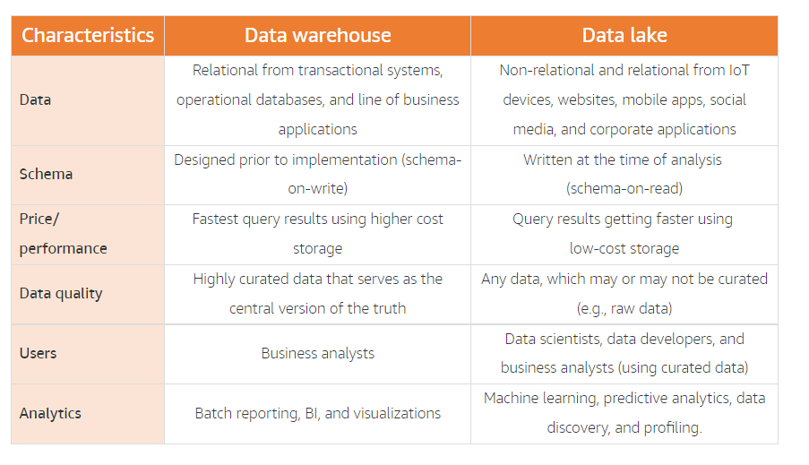
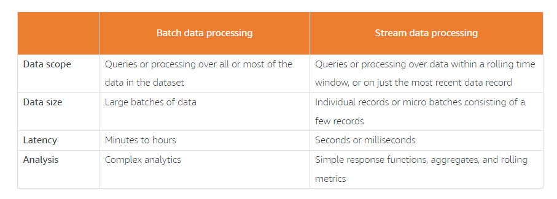
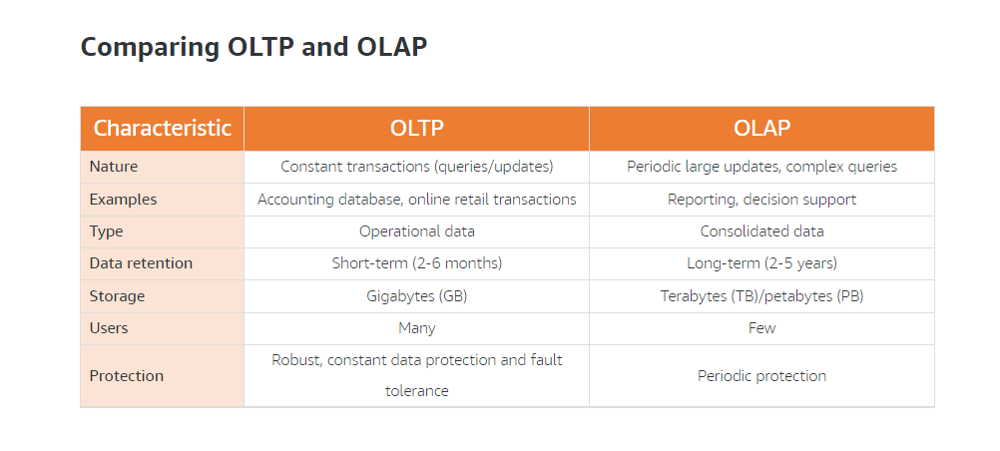
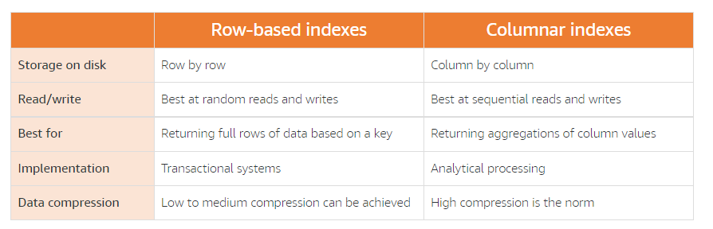
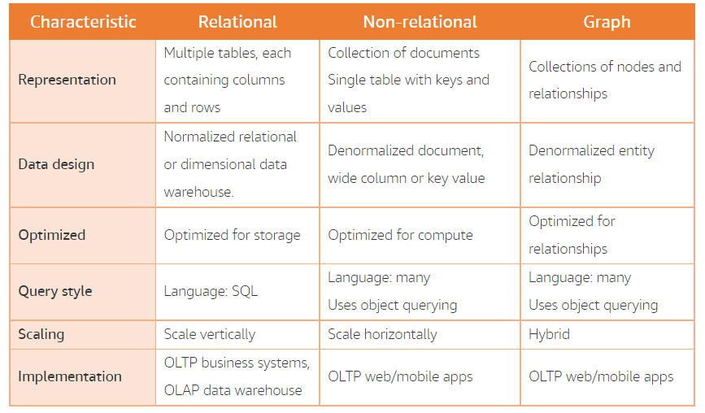
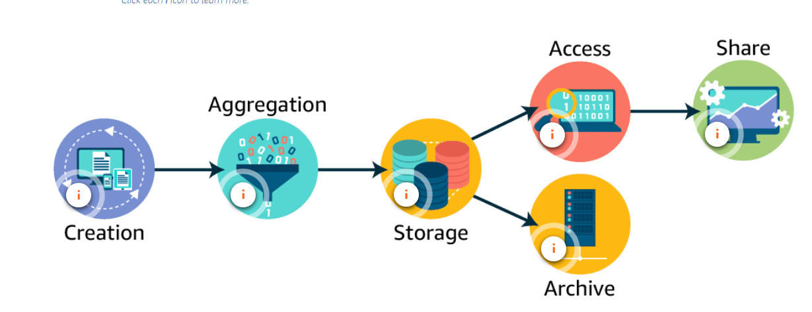
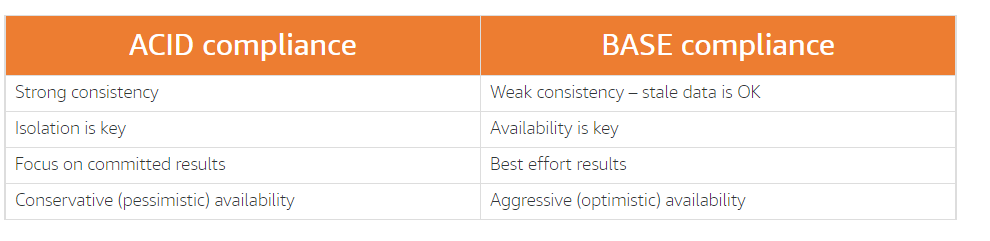
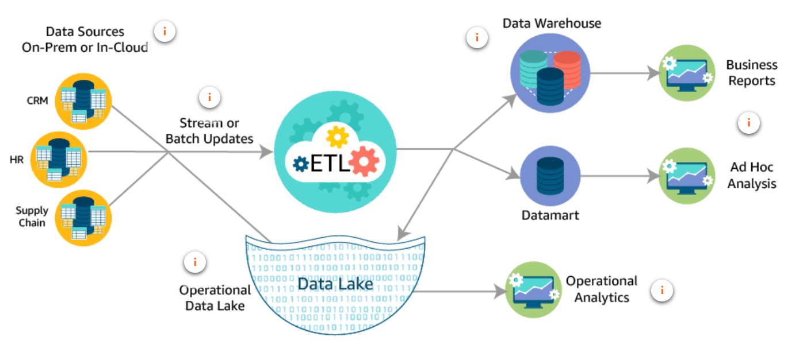
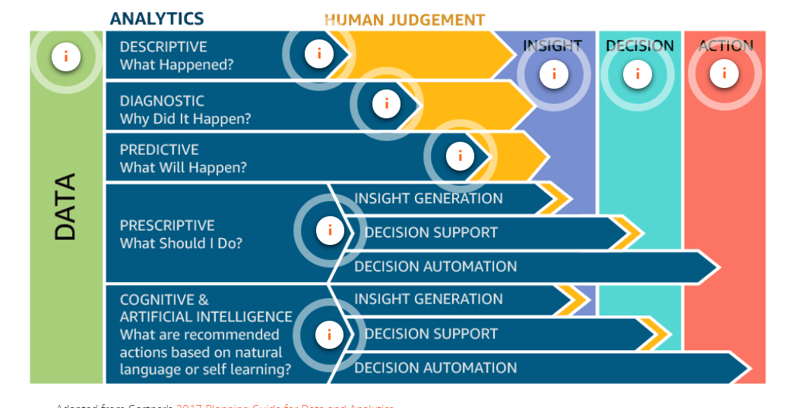

# Data Analytics Fundamentals

> Michelle Metzger | Technical Curriculum Developer with AWS
> Blaine Sundred

- In this lesson, we introduce the concept of data analytics and data analysis solutions and discuss the challenges of working with large data sets that must rapidly produce meaningful insights.
- We also introduce you to the five challenges (the 5 Vs) of data analysis-
- Lastly, we define what you need to know plan your data analysis solution.
- Topics in this lesson include:
  - Data analytics and data analysis solutions
  - Introduction to the challenges of data analytics

- Big Data / Data Analytics
- What kind of data analysis solution does your business need? In other words, how should you 
  - process
  - analyze
  - present data, all the way from ingestion to presentation?
- Cloud
  - moving big things fast, with
  - minimal setup
  - maximum security, and
  - low costs

## Definitions

- **Analysis** is a detailed examination of something in order to understand its nature or determine its essential features.
- **Data analysis** is the process of compiling, processing, and analyzing data so that you can use it to make decisions.
- **Analytics** is the systematic analysis of data.
- **Data analytics** is the specific analytical process being applied.

- Data analytics is vital to businesses large and small.
- Data analytic processes are combined to create data analysis solutions, which help businesses decide where and when to launch new products, when to offer discounts, and when to market in new areas.
- Without the data provided by data analytics, many decision makers would base their decisions on intuition and pure luck.
- **Big data** is an industry term that has changed in recent years. Big data solutions are often part of data analysis solutions.
- Data is generated in many ways. The big question is where to put it all and how to use it to create value or generate competitive advantages. 
- The **challenges **identified in many data analysis solutions can be summarized by five key challenges: 
  - volume
  - velocity
  - variety
  - veracity
  - value
- **Effective** data analysis solutions require both storage and the ability to analyze data in **near real time**, with **low latency**, while yielding **high-value returns**

## Challanges of data analytics

- Due to increasing volume, velocity, variety, veracity, and value of data, some data management challenges cannot be solved with traditional database and processing solutions.
- That's where data analysis solutions come in.

## Volume

- When businesses have more data than they are able to process and analyze, they have a volume problem.
- Businesses have been storing data for decades—that is nothing new. What has changed in recent years is the ability to analyze certain types of data.
- There are three broad classifications of data source types:
  - **Structured data** is organized and stored in the form of values that are grouped into rows and columns of a table.
  - **Semistructured data** is often stored in a series of key-value pairs that are grouped into elements within a file.
  - **Unstructured data** is not structured in a consistent way. Some data may have structure similar to semi-structured data but others may only contain metadata.  It is in every file that we store, every picture we take, and email we send.
- Many internet articles tout the huge amount of information sitting within unstructured data.
- New applications are being released that can now catalog and provide incredible insights into this untapped resource.
- Modern data management platforms must capture data from diverse sources at speed and scale.
- Data needs to be pulled together in manageable, central repositories—breaking down traditional silos.
- The benefits of collection and analysis of all business data must outweigh the costs.

### S3

- Amazon Simple Storage Service (Amazon S3) is the best place to store all of your semistructured and unstructured data.
- Amazon S3 is storage for the internet.
- This service is designed to make web-scale computing easier for developers.
- Amazon S3 provides a simple web service interface that can be used to store and retrieve any amount of data, at any time, from anywhere on the web.
- The service gives any developer access to the same highly scalable, reliable, secure, fast, inexpensive infrastructure that Amazon uses to run its own global network of websites.
- The benefits of Amazon S3 include the following:
  - Store anything
  - Secure object storage
  - Natively online, HTTP access
  - Unlimited scalability
  - 99.999999999% durability
- To get the most out of Amazon S3, you need to understand a few simple concepts. First, Amazon S3 stores **data** as **objects** within **buckets**.
  - **object** is composed of a file and any metadata that describes that file.
    - To store an object in Amazon S3, you upload the file you want to store into a bucket.
  - **Buckets** are logical containers for objects. You can have one or more buckets in your account and can control access for each bucket individually.
- Decouple data storage from compute and m processing
- Centralized data architecture
- Integration with clusterless and serverless AWS services
- Standardized Application Programming Interfaces (APIs)

### Data Lakes

- A **data lake** is a **centralized repository** that allows you to store **structured**, **semistructured**, and **unstructured** data at any scale.
- Data lakes promise the ability to store all data for a business in a single repository.
- You can leverage data lakes to store large volumes of data instead of persisting that data in data warehouses.
- Data lakes, such as those built in Amazon S3, are generally less expensive than specialized big data storage solutions.
- That way, you only pay for the specialized solutions when using them for processing and analytics and not for long-term storage.
- Your extract, transform, and load (ETL) and analytic process can still access this data for analytics.
- Benefits of Data Lakes
  - Single source of truth
  - Store any type of data, regardless of structure
  - Analyzed with AI and ML
- Benefits of a data lake on AWS
  - **cost-effective data storage** You can durably store a nearly unlimited amount of data using Amazon S3.
  - **security and compliance**. AWS uses stringent data security, compliance, privacy, and protection mechanisms.
  - **many different data collection and ingestion tools** to ingest data into your data lake. These services include Amazon Kinesis for streaming data and AWS Snowball appliances for large volumes of on-premises data.
  - **categorize and manage your data** simply and efficiently. Use AWS Glue to understand the data within your data lake, prepare it, and load it reliably into data stores. Once AWS Glue catalogs your data, it is immediately searchable, can be queried, and is available for ETL processing.
  - Help you turn data into **meaningful insights**. Harness the power of purpose-built analytic services for a wide range of use cases, such as interactive analysis, data processing using Apache Spark and Apache Hadoop, data warehousing, real-time analytics, operational analytics, dashboards, and visualizations.
- Data scientists spend 60% of their time **cleaning and organizing** data and 19% **collecting data sets**.

## Data storage methods

### Data warehouses

- A data warehouse is a **central repository** of structured data from many data sources. This data is **transformed**, **aggregated**, and **prepared** for business reporting and analysis
- A data warehouse is a central repository of information coming from one or more data sources.
- Data flows into a data warehouse from transactional systems, relational databases, and other sources.
- These data sources can include structured, semistructured, and unstructured data.
- These data sources are transformed into structured data before they are stored in the data warehouse.
- Data is stored within the data warehouse using a schema.
- A schema defines how data is stored within tables, columns, and rows.
- The schema enforces constraints on the data to ensure integrity of the data.
- The transformation process often involves the steps required to make the source data conform to the schema. 
- Following the first successful ingestion of data into the data warehouse, the process of ingesting and transforming the data can continue at a regular cadence.
- Business analysts, data scientists, and decision makers access the data through business intelligence (BI) tools, SQL clients, and other analytics applications.
- Businesses use reports, dashboards, and analytics tools to extract insights from their data, monitor business performance, and support decision making.
- These reports, dashboards, and analytics tools are powered by data warehouses, which store data efficiently to minimize I/O and deliver query results at blazing speeds to hundreds and thousands of users concurrently.
- Amazon Redshift benefits
This is where Amazon Redshift comes in. Amazon Redshift overcomes all of these negatives by providing a cloud-based, scalable, secure environment for your data warehouse. Amazon Redshift is easy to set up, deploy, and manage and provides up to 10 times faster performance than other data warehousing solutions.

### Data Marts

- A subset of data from a data warehouse is called a **data mart**.
- Data marts only **focus on one subject or functional area**.
- A warehouse might contain all relevant sources for an enterprise, but a data mart might store only a single department’s sources.
- Because data marts are generally a copy of data already contained in a data warehouse, they **are often fast and simple to implement**.

### Apache Hadoop

- Hadoop uses a distributed processing architecture, in which a task is mapped to a cluster of commodity servers for processing.
- Each piece of work distributed to the cluster servers can be run or re-run on any of the servers.
- The cluster servers frequently use the Hadoop Distributed File System (HDFS) to store data locally for processing.
- The results of the computation performed by those servers are then reduced to a single output set.
- One node, designated as the master node, controls the distribution of tasks and can automatically handle server failures.

## Velocity

- When businesses **need rapid insights** from the data they are collecting, but the **systems** in place simply** cannot meet the need**, there's a When businesses need rapid insights from the data they are collecting, but the systems in place simply cannot meet the need, there's a velocity problem.
- The speed at which data is being generated is ever accelerating.
- Emails, photos, Twitter and Facebook posts, log files, and IoT devices are all examples of data that is being generated rapidly and must be collected, processed, analyzed, and stored at high speeds.
- **Data processing** means the collection and manipulation of data to produce meaningful information. Data collection is divided into two parts, data collection and data processing.

### BAtch Processing

- In batches
- Batch processing is the execution of a series of programs, or jobs, on one or more computers without manual intervention. Data is collected into batches asynchronously.
- The batch is sent to a processing system when specific conditions are met, such as a specified time of day. The results of the processing job are then sent to a storage location that can be queried later as needed.
- Process at certain intervals
  - Schedule
  - Data Volume
- Batch data processing with Amazon EMR and Apache Hadoop
- 

#### Stream Processing

- Processing in real time
- Continuous data
- Constant stream of data

- Stream data processing with Amazon Kinesis
- In stream processing, you use multiple services:
  - one service to ingest the constant stream of data
  - one to process and analyze the stream
  - one to load the data into an analytical data store if required
- Amazon Kinesis meets each of these needs, and you can use each Kinesis service independent of the others to create an optimal streaming solution.

## Variety

- When your business becomes **overwhelmed** by the **sheer number of data sources** to analyze and you **cannot find systems** to perform the analytics, you know you have a **variety** problem.
- There are arguably as many different types of data as there are people.
- This wide variety quickly becomes a challenge for businesses that are looking for diversity in their analytics.

### Source Data Storage

- Every data analysis solution begins with data sources.
- A data source can be just about anything—a folder on a file server, database, web page, and even a wearable device can be considered a data source.
- In each of these data sources, data is stored in a specific way.Some data sources use a schema to organize content and indexes to improve performance.
- Others organize data in a more flexible way and are called schemaless.
- Schemaless data sources still use indexes to improve performance. 
- Data types
  - Structured
    - Stored in a tabular format, often within a database management system (DBMS).
    - This data is organized based on a relational data model, which defines and standardizes data elements and their relation to one another.
    - Data is stored in rows, with each row representing a single instance of a thing (for example, a customer)
    - These rows are well understood due to the table schema, which explains what each field in the table represents.
    - This makes structured data easy to query.
    - The downside to structured data is its lack of flexibility. 
    - Examples of structured data applications include 
      - Amazon RDS
      - Amazon Aurora
      - MySQL
      - MariaDB
      - PostgreSQL
      - Microsoft SQL Server
      - Oracle
  - Semi-structured
    - Is stored in the form of elements within a file.
    - This data is organized based on elements and the attributes that define them.
    - It doesn't conform to data models or schemas.
    - Semistructured data is considered to have a self-describing structure.
    - Each element is a single instance of a thing, such as a conversation.
    - The attributes within an element define the characteristics of that conversation.
    - Each conversation element can track different attributes.
    - This makes semistructured data quite flexible and able to scale to meet the changing demands of a business much more rapidly than structured data.
    - The trade-off is with analytics.
    - It can be more difficult to analyze semistructured data when analysts cannot predict which attributes will be present in any given data set.
    - Examples of semistructured data stores include
      - CSV
      - XML
      - JSON
      - Amazon DynamoDB
      - Amazon Neptune
      - Amazon ElastiCache
  - Unstructured
    - is stored in the form of files.
    - This data doesn't conform to a predefined data model and isn't organized in a predefined manner.
    - Unstructured data can be text-heavy, photographs, audio recordings, or even videos.
    - Unstructured data is full of irrelevant information, which means the files need to be preprocessed to perform meaningful analysis.
    - Examples of unstructured data include
      - emails
      - photos
      - videos
      - clickstream data
      - Amazon S3, and 
      - Amazon Redshift Spectrum
- **Structured data** is hot, **immediately ready** to be analyzed.
- **Semistructured data** is lukewarm—some data will be ready to go and other data may **need to be cleansed** or preprocessed.
- **Unstructured** data is the **frozen ocean**—full of exactly what you need but separated by all kinds of **stuff you don’t need**.

### Flat-file data

- Flat-file data generally resides in a worksheet or spreadsheet.
- This may not seem like a database, but it meets all of the basic requirements.
- This format provides a solid foundation for understanding some of the considerations when choosing a DBMS.

### Relational databases

- Flat-file storage may not fit your structured data storage needs.
- The next logical step is to move to a more robust solution: a relational database.
- A process known as normalization helps a business take flat-file data and turn it into a relational database.
- Normalization is a set of rules that work together to reduce redundancy, increase reliability, and improve the consistency of data storage.
- A relational database is built to store structured data so it can be collected, updated, and queried easily.
- Relational databases rely on a series of structures, called tables, to hold the collected data.
- These tables are navigated using the structured query language, or SQL.
- Strengths
  - Provides ACID compliance
  - Data is easily stored, edited and retrieved using a common SQL language
  - The structure can be scaled up quickly
- Weaknesses
  - Struggle storing unstructured data
  - Querying can be slow due to complex join requirements
  - The schema can can make scaling out quite difficult

#### Types of information systems

- There are two main ways—known as information systems—of organizing data within a relational database. The data can be organized to focus on the storage of transactions or the process of analyzing transactions.
- Transactional databases are called online transaction processing (OLTP) databases. The data gathered by OLTP databases is often fed into another type of database that focuses on analyzing the transactional data.
- Online analytical processing (OLAP) databases gather data from OLTP systems for the purpose of organizing it for analytical operations.

#### Row-based and columnar data indexing

- Data within a database should be indexed to allow a query to quickly find the data it needs to produce a result.
- Indexes control the way data is physically stored on disk.
- They physically group records into a predictable order based on the key values within the table.
- This plays a huge part in the speed and efficiency of queries.
- In an **OLTP** system, the most common queries are called lookup queries.
  - These queries need to return several columns of data for each matching record.
  - In this type of system, you might query to get details for a specific order.
- In an **OLAP** system, the most common queries are aggregate queries. 
  - These queries take large numbers of rows and reduce them to a single row by aggregating the values in one or more columns.
  - In this type of system, you might query to find out the total number of items sold on a specific date.
- Both OLTP and OLAP systems can use either indexing method. However, there are advantages to choosing the method that is best suited to the types of queries that will be run the majority of the time.

### Relational database pros and cons

- The primary benefit of a relational database using SQL is that it is proven technology that is widely adopted and understood.
- There is less risk involved with a relational database, especially due to ACID compliance and a large community of experts in the field.
- There is an expectation of very good transactional latency, especially on appropriately sized hardware, and relational databases are considered outstanding for OLTP for relatively small data sets.
- There are scalability concerns with a relational database.
  - As data sets grow, the only way to maintain performance is to increase the hardware capacities of the servers that run the application. Another key issue is the fixed schema of relational databases.
  - It is difficult to make non-disruptive changes to the underlying database architectures, which can affect development times for new functionality.

### Preparing relational data for data processing

- When working with a relational database, you must pay attention to how the data will be used within the data analysis solution.
- It is very common to perform multiple types of analytics on the same data.
- OLTP data may need to be transformed into a denormalized form and placed into a data warehouse or data mart.
- OLAP data may not require any transformation.
- There may even be opportunities to transform data into staging databases that can be used as a data source for other analytic processes.

### Semistructured / Unstructured

- Semistructured and unstructured data are often stored in non-relational database systems, sometimes called NoSQL databases.
- This term can cause a bit of confusion.
- It is important to remember that SQL is a way of querying data.
- It implies precise structure.
- Non-relational or NoSQL does not mean the data stored cannot be queried using SQL.
- A better way to think of it is not only SQL.

#### Non-relational databases

- Non-relational databases are built to store semistructured and unstructured data in a way that provides for rapid collection and retrieval.
- There are several broad categories of non-relational databases, and data is stored in each to meet specific requirements.

#### Document stores

- Document stores are a type of non-relational database that store semistructured and unstructured data in the form of files.
- These files range in form but include JSON, BSON, and XML.
- The files can be navigated using numerous languages including Python and Node.js.
- Logically, files contain data stored as a series of elements.
- Each element is an instance of a person, place, thing, or event.
- For instance, the document store may hold a series of log files from a set of servers.
- Strengths:
  - Flexibility
  - No need to plan for a specific type of data when creating one
  - Easy to scale
- Weaknesses:
  - Sacrifice ACID compliance for flexibility
  - Cannot query across files

#### Key-value stores

- Key-value databases are a type of non-relational database that store unstructured data in the form of key-value pairs.
- Logically, data is stored in a single table.
- Within the table, the values are associated with a specific key.
- The values are stored in the form of blob objects and do not require a predefined schema.
- The values can be of nearly any type.
- Strengths: 
  - Very flexible
  - Able to handle a wide variety of data types
  - Keys are linked directly to their values with no need for indexing or complex join operationsContent of a key can easily be copied to other systems without reprogramming the data
- Weaknesses: 
  - Impossible to query values because they are stored as a single blob
  - Updating or editing the content of a value is quite difficult
  - Not all objects are easily modeled as key-value pairs

#### Schema changes in relational and non-relational databases 

- To understand the powerful flexibility in non-relational databases, you need to understand what it takes to make changes to the organization of data between relational and non-relational database objects.
- **Data schemas** A relational database stores data in the form of tables that contain 
- **Schema changes in a relational database** The needs of the business have changed. You need to add a new column to track each product's rating. Not all products have a rating yet, so you need to allow the column to accept NULL values.
  - To add a new column to the table, you must:
    - Execute a SQL command to add the column.
    - The table now contains an empty column.
    - Populate the new column with a value for each existing record.
- **Schema changes in a non-relational database**
  - When the same requirement is placed on data in a non-relational database, the remedy is quite different.
  - You simply add the data for that record.
  - With a non-relational database, each record can have its own set of attributes.
  - This flexibility is one of the greatest benefits of non-relational databases.

#### Graph Databases

- **Graph databases** are purpose-built to store any type of data: structured, semistructured, or unstructured
- The purpose for organization in a graph database is to navigate relationships.
- Data within the database is queried using specific languages associated with the software tool you have implemented.
- Logically, data is stored as a node, and edges store information on the relationships between nodes.
- An edge always has a start node, end node, type, and direction, and an edge can describe parent-child relationships, actions, ownership, and the like.
- There is no limit to the number and kind of relationships a node can have.
- Strengths:
  - Allow simple, fast retrieval of complex hierarchical structures
  - Great for real-time big data mining
  - Can rapidly identify common data points between nodes
  - Great for making relevant recommendations and allowing for rapid querying of those relationships
- Weaknesses:
  - Cannot adequately store transactional data
  - Analysts must learn new languages to query the data
  - Performing analytics on the data may not be as efficient as with other database types

#### Non-relational database pros and cons

- Non-relational databases have the primary benefit of going beyond the limitations of relational databases, especially through dynamic schemas, which give DBAs the ability to update schemas on the fly.
- This leads to faster development cycles and less downtime.
- Also, because non-relational databases can be deployed on massively distributed commodity servers, these databases have an advantage in scaling and can handle much larger data sets.
- The massive distribution does have a downside, in the form of “eventual consistency,” which means that data is not instantaneously updated with every change and instead catches up as a background task.
- Although this is acceptable under many circumstances, it does make ACID compliance difficult to achieve.
- Note that DynamoDB does support ACID compliance.
- Another drawback is that non-relational databases do not perform as well as relational databases in applications that require extremely low transactional latency.
- Finally, although non-relational platforms are constantly evolving and growing, there isn’t nearly the same maturity as relational technologies or the same amount of field expertise.

---

## Veracity

- When you have data that is **ungoverned**, coming from numerous, **dissimilar systems** and cannot curate the data in meaningful ways, you know you have a **veracity** problem.
- **Curation** is the action or process of selecting, organizing, and looking after the items in a collection.
- **Data integrity** is the maintenance and assurance of the accuracy and consistency of data over its entire lifecycle.
- **Data veracity** is the degree to which data is accurate, precise, and trusted.

### The problem of veracity

- Data changes over time.
- As it is transferred from one process to another, and through one system and another, there are opportunities for the integrity of the data to be negatively impacted.
- You must ensure that you maintain a high level of certainty that the data you are analyzing is trustworthy.
- Data veracity is contingent on the integrity of the data.

### What is data integrity?

- As the name reads, data integrity is all about making sure your data is trustworthy.
- Does it have integrity?
- Was the entire data chain secure and uncompromised?
- Understanding the full lifecycle of your data and knowing how to protect it effectively will greatly strengthen the integrity of your data.

- **Data cleansing** is the process of detecting and correcting corruptions within data.
- **Referential integrity** is the process of ensuring that the constraints of table relationships are enforced.
- **Domain integrity** is the process of ensuring that the data being entered into a field matches the data type defined for that field
- **Entity integrity** is the process of ensuring that the values stored within a field match the constraints defined for that field.

### Identifying data integrity issues

- As a data analyst, you may be called upon to perform data integrity checks.
- During this process, you will be looking for potential sources of data integrity problems.
- Data can come from both internal and external sources.
- It is highly unlikely that you will be able to have influence on data generated outside of your business.
- However, within your business, you may have the ability to make recommendations on improvements for the data sources you will be interacting with.
- When changing the way the source systems are ingesting data is not an option, it is often the responsibility of the data analyst to determine the integrity of the data source in question and make adjustments to account for any area where that source may be lacking integrity.

### Understanding Data Concistency

- To maintain veracity in stored data, consistency is key.
- When data is stored as files, consistency is controlled by the application that is developing the files.
- When data is stored in a database, consistency is the responsibility of the database that is housing the data.
- In this topic, we will discuss the two methods that databases implement: **ACID** and **BASE**.

### ACID

- **Atomicity**
  - When executing a transaction in a database, atomicity ensures that your transactions either completely succeed or completely fail
  - No one statement can succeed without the others.
  - Because many requests to a database are multi-faceted, this interaction is very important for avoiding faults in your data set
  - When atomicity fails, the results can be devastating.
  - Imagine an operation that is set to copy all orders from a temporary table into a permanent table every 10 minutes.
  - If a single record within that transaction fails, everything following it will also fail.
- **Consistency**
  - Consistency ensures that all transactions provide valid data to the database.
  - This data must adhere to all defined rules and constraints.
  - For a transaction to complete successfully, all of the statements within it must be valid against all relevant constraints set in the database.
  - If any single statement violates these checks, the whole transaction will be rolled back, and the database will be returned to its previous state.
  - Consistency also ensures that data updates are not made available until all replicates have been updated as well.
- **Isolation**
  - Isolation ensures that one transaction cannot interfere with another concurrent transaction.
  - Databases are busy places.
  - Isolation ensures that when multiple transactions request the same data, there are rules in place ensuring that the operations will not cause data corruption and that all data will be made available in an orderly fashion.
- **Durability**
  - Data durability is all about making sure your changes actually stick.
  - Once a transaction has successfully completed, durability ensures that the result of the transaction is permanent even in the event of a system failure.
  - This means that all completed transactions that result in a new record or update to an existing record will be written to disk and not left in memory.
- It is a method for maintaining consistency and integrity in a structured database.
- All four of these properties work together to enforce integrity in a relational database.
- Many regulations require businesses to implement ACID-compliant databases.
- However, in a world where unstructured data, non-relational data, and distributed systems are taking up ever increasing percentages of a business’ data consumption, another option is necessary.

### ACID compliance

- ACID is the long-standing bastion of relational data integrity.
- In a database such as Amazon RDS, a sequence of statements executed together is called a transaction. Millions of transactions can be performed consecutively.
- The data and the constraints on that data are very active in relational databases.
- The goal of an ACID-compliant database is to return the most recent version of all data and ensure that data entered into the system meets all rules and constraints that are assigned at all times.

### BASE

- Basically Available
  - BA allows for one instance to receive a change request and make that change available immediately.
  - The system will always guarantee a response for every request.
  - However, it is possible that the response may be a failure or stale data, if the change has not been replicated to all nodes.
  - In an ACID system, the change would not become available until all instances were consistent.
  - Consistency in a BASE model is traded for availability.
- Soft state
  - In a BASE system, there are allowances for partial consistency across distributed instances.
  - For this reason, BASE systems are considered to be in a soft state, also known as a changeable state.
  - In an ACID system, the database is considered to be in a hard state because users cannot access data that is not fully consistent.
- Eventually consistent
  - This reinforces the other letters in the acronym.
  - The data will be eventually consistent.
  - In other words, a change will eventually be made to every copy.
  - However, the data will be available in whatever state it is during propagation of the change.
- It is a method for maintaining consistency and integrity in a structured or semistructured database.

### BASE compliance

- BASE supports data integrity in non-relational databases, which are sometimes called NoSQL databases.
- Non-relational databases like Amazon DynamoDB still use transactions for processing requests.
- These databases are hyperactive, and the primary concern is availability of the data over consistency of the data. To ensure the data is highly available, changes to data are made available immediately on the instance where the change was made.
- However, it may take time for that change to be replicated across the fleet of instances.
- The aim is that the change will eventually be fully consistent across the fleet.

### ETL Process

- Source data is messy, in a thousand locations, and rarely developed with the same style of organization.
- Trying to make sense of this mess without transforming the source data is like trying to clearly hear a single voice in a crowd.
- You may catch parts of the conversation, but it will loose context and validity quickly.

### Understanding ETL

- ETL—Extract, Transform, Load—is the process of collecting data from raw data sources and transforming that data into a common type.
- This new data is loaded into a final location to be available for analytical analysis and inspection.
- In modern cloud-based environments, we often refer to this process as ELT (Extract, Load, Transform) instead
- The steps are simply performed in a different order, but the result is the same.

### Transforming your data – comparing Amazon EMR and AWS Glue

- When it comes to performing the data transformation component of ETL, there are two options within AWS:
  - Amazon EMR and 
  - AWS Glue.

#### Amazon EMR

- More hands-on approach to creating your data pipeline.
- This service provides a robust data collection and processing platform.
- Using this service requires you to have strong technical knowledge and know-how on your team.
- The upside of this is that you can create a more customized pipeline to fit your business needs.
- dditionally, your infrastructure costs may be lower than running the same workload on AWS Glue.

#### AWS Glue

- Serverless, managed ETL tool that provides a much more streamlined experience than Amazon EMR.
- This makes the service great for simple ETL tasks, but you will not have as much flexibility as with Amazon EMR.
- You can also use AWS Glue as a metastore for your final transformed data by using the AWS Glue Data Catalog. This catalog is a drop-in replacement for a Hive metastore.

- When making your decision about which of these tools to work with, decide with the end in mind.
- Are you going to want a continuous data pipeline that requires very little overhead?
- Do you need massive parallel data processing?
- How much customization will your data solution require?

## Value

- When you have **massive volumes** of **data** used to support a **few golden** insights, you may be missing the **value** of your data.
- We have discussed data collection and the speed of collection, data storage, capacity, processing, and analytics.
- All of these have one thing in common: they do not evaluate the data for usefulness.
- Storing terabytes of data that no one will ever look at, analyze, or visualize is a futile effort.
- The real effort should be placed in finding out what the value of that data actually is and then learning ways to extract that value from the terabytes of data your business has collected.

> ""We believe **data is our oil**, our gold. But having hundreds of millions of terabytes of **data that isn't actionable** really does nothing for me." - Rob Roy, Chief Digital Officer at Sprint

### What is data analytics?

- Data in the absence of meaning is meaningless.
- Words in a language you don't understand are equally meaningless.
- It is only when meaning is supplied that the data or words can be understood.
- Data analytics comes in two classifications:
  - **Information Analytics**
    - Process of analyzing information to find the value contained within it.
    - It is a broad classification of data analytics that can cover topics from the financial accounting for a business to analyzing the number of entries and exits in a secured building.
  - **Operational Analytics**
    - quite similar to information analyticsHowever, it focuses on the digital operations of an organization.

> “It is a capital mistake to theorize before one has data. Insensibly, one begins to twist the facts to suit theories, instead of theories to suit facts.” – Sherlock Holmes

### Operational analytics

- Businesses have thousands of systems, applications, and customers that are constantly generating data.
- This is one of the fastest growing areas of data collection.
- Operational analytics is a form of analytics that is used specifically to retrieve, analyze, and report on data for IT operations.
- This data includes system logs, security logs, complex IT infrastructure events and processes, user transactions, and even security threats
- Benefits
  - Timely Action
  - Immediate visibility
  - Continuous insights

### Predictive analytics

- AWS has Amazon ML and a set of services (including artificial intelligence [AI]) that make it easy for developers to apply predictive analytics to their data and add new, smart data-processing features to their applications.
- Amazon has a long and rich tradition around machine learning (ML), and much of this accumulated technology has been packaged up for customer use with this service.
- The machine learning stack has three key layers:
  - **Application services** to enable developers to plug prebuilt AI functionality into their apps without having to worry about the ML models that power these services
  - **Platform services** to make it easy for any developer to get started and get deep with ML
  - **Frameworks and interfaces** for ML practitioners
In the following architecture, you see an example for using Amazon ML to produce real-time predictions to users of an application. In this architecture, there are several services working together to produce the predictions.

### Cognitive analytics

- Cognitive analytics is the newest form of data analytics.
- It is providing an incredible opportunity to provide highly specialized recommendations to businesses without any human involvement, past the initial configuration and training of the ML models.
- Some real world examples of cognitive analytics include:
  - Financial software providing accurate, real-time, fact-based investment recommendations
  - Healthcare software giving customers access to reliable recommendations on treatments and up-to-date healthcare options
  - Veterinary software helping veterinarians to quickly and accurately diagnose their patients
  - Software aiding fantasy football leagues and enthusiasts to manage their teams

### Analytic services and velocity

- The first time you push data through a data analytics system, the data will flow from ingestion into a staging storage location.
- Data will then be processed from the staging location and may result in the data being placed in an analytical data store.
- Processing of the data from the staging location may be repeated many times to produce many different analytical results.
- It is important to have a solid understanding of the speed you can expect from the different processing types.

### Batch analytics

- Typically involves querying large amounts of “cold” data.
- Batch analytics are implemented on large data sets to produce a large number of analytical results on a regular schedule.
- MapReduce-based systems, such as Amazon EMR, are examples of platforms that support batch analytics.
- High-level frameworks that run on Apache Hadoop can streamline and significantly speed up your batch analytics.
- The framework you should use depends heavily on the type of workload you have.
- Some of the most popular frameworks used with Hadoop are Hive, Flink, Tez, HBase, Presto, Pig, and Spark.
- Each of these frameworks can be installed on Amazon EMR clusters.

### Interactive analytics

- Typically involves running complex queries across complex data sets at high speeds.
- This type of analytics is interactive in that it allows a user to query and see results right away.
- Batch analytics are generally run in the background, providing analytics in the form of scheduled report deliveries.
- For interactive analysis, **Amazon Athena** makes it easy to analyze data directly in Amazon S3 and Amazon S3 Glacier using standard SQL queries.
- Athena is serverless, so there is no infrastructure to set up or manage.
- You can start querying data instantly, get results in seconds, and pay only for the queries you run.
- Simply point to your data in Amazon S3, define the schema, and start querying using standard SQL.
- **Amazon ES** allows you to search, explore, filter, aggregate, and visualize your data in near-real time.
  - The service has easy-to-use APIs and real-time analytics capabilities alongside the availability, scalability, and security that production workloads require.
- **Amazon Redshift** provides the ability to run complex, analytic queries against petabytes of structured data and includes Redshift Spectrum, which runs SQL queries directly against exabytes of structured or unstructured data in Amazon S3 without the need for unnecessary data movement.

### Stream analytics

- Requires ingesting a sequence of data and incrementally updating metrics, reports, and summary statistics in response to each arriving data record. This method is best suited for real-time monitoring and response functions.
- Streaming data processing requires two layers:
  - **Storage layer**
    - Nneeds to support record ordering and strong consistency to enable fast, inexpensive, and
re-playable reads and writes of large streams of data
  - **Processing layer** 
    - Responsible for consuming data from the storage layer, running computations on that data, and then notifying the storage layer to delete data that is no longer needed
- Many platforms have emerged that provide the infrastructure needed to build streaming data applications including Amazon Kinesis, Apache Kafka, Apache Flume, Apache Spark Streaming, and Apache Storm.
- **Amazon Kinesis** is a platform for streaming data on AWS, offering powerful services to make it easy to load and analyze streaming data and enables you to build custom streaming data applications for specialized needs.
  - Kinesis offers two services: Amazon Kinesis Data Firehose and Amazon Kinesis Data Streams.
- If the data in your stream needs format conversion, transformation, enrichment, or filtering, you can preprocess the data using an **AWS Lambda** function.
  - You can do this before your application SQL code executes or before your application creates a schema from your data stream.
- You can install streaming data platforms of your choice on the Amazon Elastic Compute Cloud (Amazon EC2) and Amazon EMR and build your own stream storage and processing layers.
- By building your streaming data solution on Amazon EC2 and Amazon EMR, you can avoid the friction of infrastructure provisioning and gain access to a variety of stream storage and processing frameworks.
- Options for the streaming data storage layer include Apache Kafka and Apache Flume.
- Options for the stream processing layer include Apache Spark Streaming and Apache Storm.

## Data Visualization

> "Data analysis isn't really about data and charts. It's about finding and telling a story." -Glen Rabbie, CEO Yellowfin

### Data preparation

- **Inspecting data** - This first phase is generally part of the planning involved in creating an ETL operation.
- **Cleansing data** - This is the process of normalizing the data within the ETL operation to ensure that the fields contain the correct values and to deal with the issue of missing values.
- **Transforming data** - This phase involves applying functions to manipulate data into new forms for analytic purposes.
- **Visualizing data** - This is the process of building out reports and dashboards to present the value within the data.

### What's in a report?

- Analytical reporting comes in many different shapes and sizes.
- The source of the data rarely has any impact on the resulting reports.
- The reports are organized to meet the needs of the consumers of the reports.
- There are three broad types of reports:
  - **Static reports** have not died out in this digital age.
    - Still hugely popular for presentations and meetings.
    - The are found in the form of PDFs and PowerPoint slides and can often be accessed through web portals and software interfaces.
  - **Interactive reports** are becoming more common all the time.
    - These types of reports generally fall under the heading of self-service business intelligence.
    - These reports often take on a print-based report style but have the advantage that consumers can apply filters to charts and graphs, change the scales, and even group and sort values within the reports.
    - This allows a consumer to tell their own story using the foundation laid by the report builder.
  - **Dashboards** are another very popular reporting tool.
    - Whether dashboards are interactive depends on the software used.
    - Consumers find the greatest benefit in dashboards when they focus on high-level roll-ups of key business factors.
- Reports and dashboards are made up of multiple charts, tables, and graphs to answer questions.
- The clearer the questions are, the better the report or dashboard will be at providing answers.
- Reports and dashboards can also be broken up into pages or views.
  - These pages should have a single theme for all of the report elements within them.
  - It is very common to provide consumers of interactive reports and dashboards with filters that can be applied to either the whole page or to individual elements within the page.

### Best practices for writing reports

- Building a solid report that will provide consumers with what they need to make critical decisions is a bit of an art form.
- There are a few steps to be successful:
  - Gather the data, facts, action items, and conclusions.
  - Identify the audience, expectations they have, and the proper method of delivery.
  - Identify the visualization styles and report style that will best fit the needs of the audience.
  - Create the reports and dashboards.

## Key Takeaways